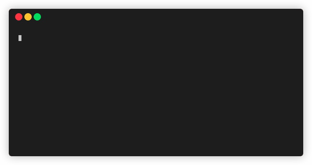

# POMO

A command-line based pomodoro timer.



Run `pomo`, list your tasks and start working.
`pomo` will count your pomodoros and breaks for you.

## Quick Start

```bash
git clone https://github.com/mikeevmm/pomo
cd pomo 
bash install.sh
pomo --help
```

## Setting the editor

By default, `pomo` uses `vim` to prompt the tasks.

If you are unfamiliar with `vim`, or would rather not use it, you can set the editor to, for example, `nano` with

```bash
pomo set editor /bin/nano
```

## Setting other variables

You can see all of `pomo`'s variables by calling

```bash
pomo --list
```

In particular, you can change the times of the pomodoros and breaks by calling

```bash
pomo set long 10m # Sets the long break to 10 minuts
pomo set short "30 seconds" # Sets the short break to 30 seconds
pomo set pomodoro 1h # Sets the pomodoro times to be 1 hour
```

For times, you can use a number followed by s/m/h or seconds/minutes/hours. If you use the latter, make sure to enclose the value in quotes (e.g., `"10 minutes"`). If you don't specify a unit, seconds will be assumed.

## License

This tool is licensed under an MIT license.
See LICENSE for details.

## Support

💕 If you liked pomo, consider [buying me a coffee](https://www.paypal.me/miguelmurca/2.50).
